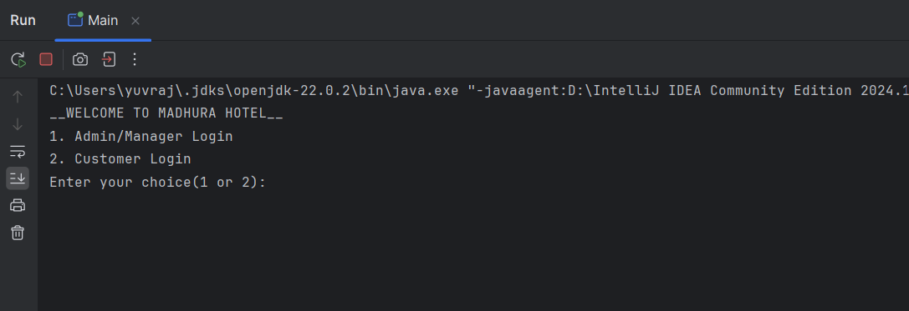
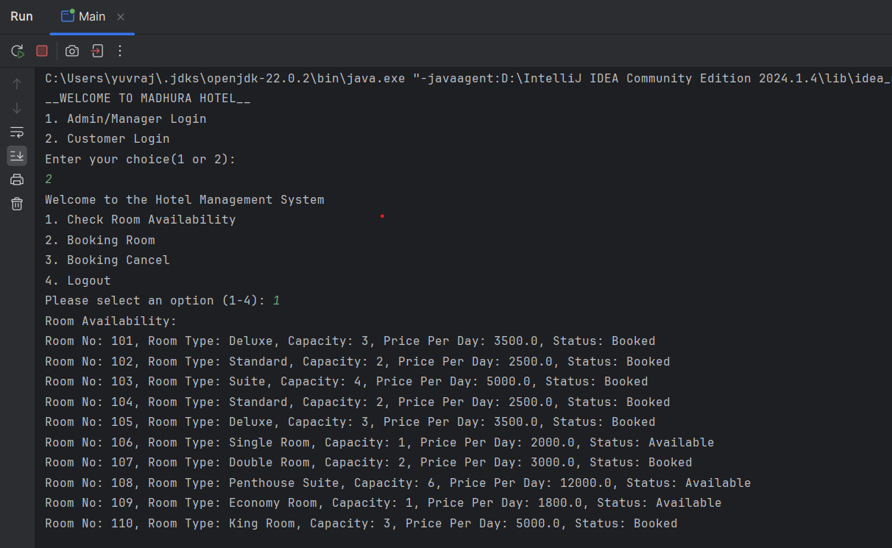
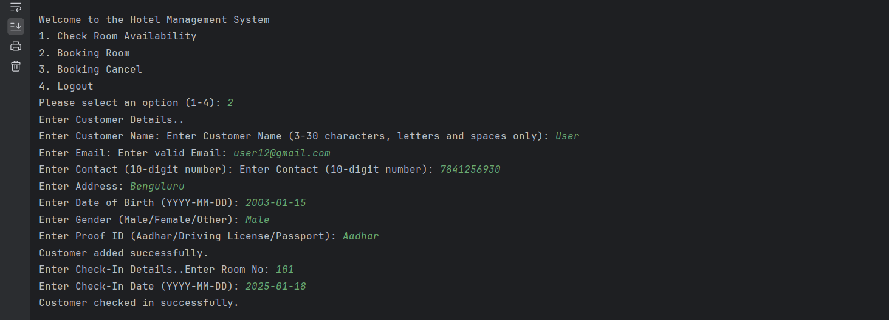
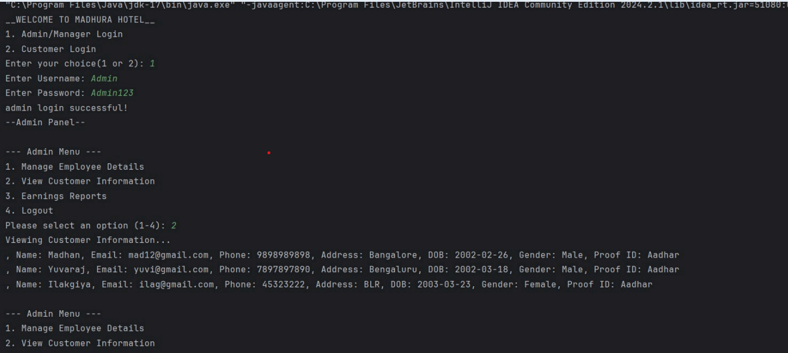
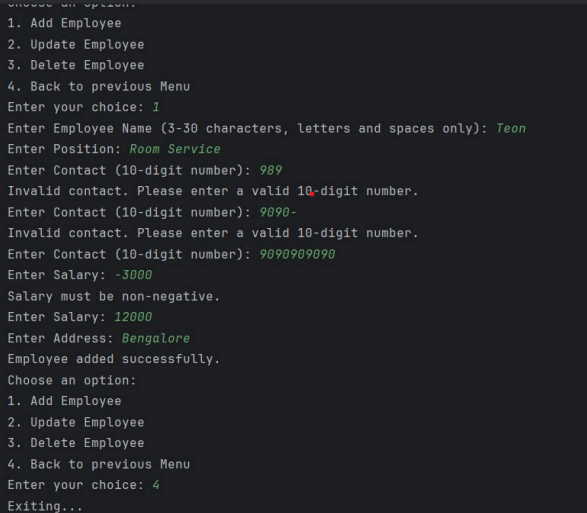

  # Hotel Management System

## Overview
The **Hotel Management System** is a Java-based application designed to streamline hotel operations such as room booking, customer management, employee management, and financial reporting. This system provides a digital solution for handling reservations, cancellations, check-ins, and check-outs efficiently, reducing errors and improving resource utilization.

## Screenshots
### Login Panel


### Customer Login & Room Booking



### Admin & Manager Dashboard



## Features
### Customer Module
- View room availability
- Book and cancel rooms
- Check-in and check-out details
- Secure customer data management

### Manager Module
- View and add rooms
- Handle customer check-out
- View and manage employee details

### Admin Module
- Manage employee records
- View customer information
- Generate earnings reports

## Problem Statement
Hotels face multiple challenges with traditional manual booking systems:
- High error rates in manual reservations
- Inefficient room allocation
- Poor customer record management
- Complex billing procedures

## Proposed Solution
- **Automated Booking System**: Ensures quick and error-free reservations
- **Real-time Room Availability**: Provides accurate room status
- **Secure Data Management**: Stores customer and employee information securely
- **Integrated Billing System**: Simplifies transactions and financial tracking

## Tech Stack
- **Language**: Java
- **Database**: MySQL
- **FrameWork**: JDBC
  
##Database Configuration
1.Set up MySQL database
2.Import the provided SQL schema
3.Update database credentials in config.properties

### Clone the Repository
```sh
git clone https://github.com/YourUsername/HotelManagementSystem.git
cd HotelManagementSystem
